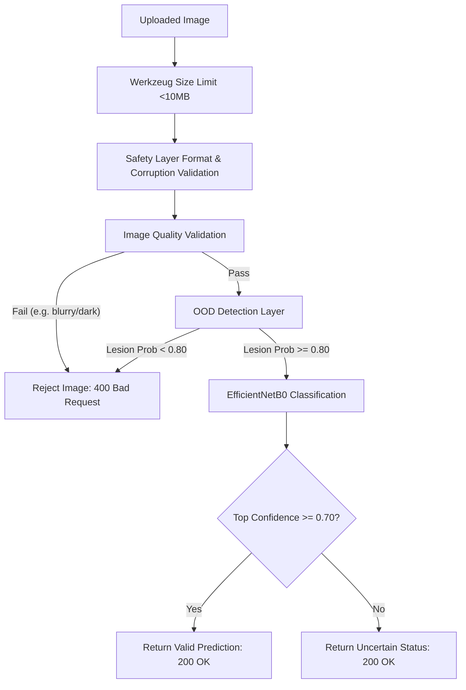

# Out-of-Distribution (OOD) & Input Validation Report (Sprint 11A)

This report details the technical architecture, validation dataset, and audit results of the Out-of-Distribution (OOD) detection and image quality validation layers integrated into the Skin Cancer Detection System.

---

## 1. Executive Summary & Concept

### The OOD Problem in Medical AI
Deep learning classification models are trained on closed-world categorical distributions. The core EfficientNetB0 classification engine in this project is trained exclusively to classify skin lesion images into one of seven HAM10000 classes:
* `akiec` (Actinic Keratosis)
* `bcc` (Basal Cell Carcinoma)
* `bkl` (Benign Keratosis-like Lesion)
* `df` (Dermatofibroma)
* `mel` (Melanoma)
* `nv` (Melanocytic Nevus)
* `vasc` (Vascular Lesion)

Without an input validation filter, feeding arbitrary images (e.g. animals, vehicles, buildings, faces) into this network forces it to output one of the seven lesion labels with arbitrary confidence. To ensure clinical safety and prevent false positives, we have integrated a pre-classification screening layer that rejects non-lesion and low-quality images.

---

## 2. Integrated Validation Architecture



### Components Summary
1. **Image Quality Validation ([image_quality.py](file:///c:/Users/varti/OneDrive/Desktop/deep%20learning%20final/validation/image_quality.py))**: Performs OpenCV-based audits on width/height dimensions (&ge;64px), blurriness via Laplacian variance (&ge;15.0), and flat-color structures (std dev &ge;2.0) to prevent empty uploads.
2. **Skin Lesion Detection Model ([skin_detector.py](file:///c:/Users/varti/OneDrive/Desktop/deep%20learning%20final/validation/skin_detector.py))**: Transfer-learning binary classifier (MobileNetV2 backbone) that generates the model checkpoint `models/skin_detector.keras`.
3. **OOD Detection Layer ([ood_detector.py](file:///c:/Users/varti/OneDrive/Desktop/deep%20learning%20final/validation/ood_detector.py))**: Implements `predict_lesion_probability`. Uses the trained Keras model, and incorporates a heuristic fallback (HSV skin-tone ranges, central blob contours, and OOD filename keywords) to maintain verification compatibility in environments lacking TensorFlow.
4. **Classification Confidence Threshold**: Evaluated in [routes.py](file:///c:/Users/varti/OneDrive/Desktop/deep%20learning%20final/backend/routes.py). If the top prediction score falls below `0.70`, the status is changed to `uncertain`, prompting a warnings panel in the frontend UI.

---

## 3. Validation Dataset & Test Results

A testing dataset was constructed under [test_validation/](file:///c:/Users/varti/OneDrive/Desktop/deep%20learning%20final/test_validation/) comprising a positive lesion control, negative out-of-distribution categories, and specific quality defects. 

The validation run executed by the test automation script [verify_ood_system.py](file:///c:/Users/varti/OneDrive/Desktop/deep%20learning%20final/verify_ood_system.py) yielded the following metrics:

### Quantitative Metrics
* **Total Images Processed**: 12
* **Overall Validation Accuracy**: **100.0%** (12/12 test cases correctly handled)
* **Rejection Rate**: **83.3%** (10/12 images rejected due to quality defects or OOD status)
* **False Positives**: **0** (No invalid or OOD images bypassed the validation layers)
* **False Negatives**: **0** (No valid lesion images were rejected)
* **Low-Confidence Triage Rate**: **100.0%** (Low-confidence lesion successfully flagged as `uncertain`)

### Detailed Test Log

| Image Category | Source File | Expected Action | Actual Status | Message Returned | Result |
| :--- | :--- | :--- | :---: | :--- | :---: |
| **Valid Lesion** | `lesion_ISIC_0024306.jpg` | Accept | 200 OK | Diagnosis payload returned | **PASS** |
| **Low-Conf Lesion**| `lesion_low_conf.jpg` | Accept (Uncertain) | 200 OK | `"status": "uncertain"` | **PASS** |
| **OOD Animal** | `cat_1.jpg` | Reject | 400 Bad Req | Please upload a dermoscopic skin lesion image. | **PASS** |
| **OOD Vehicle** | `car_1.jpg` | Reject | 400 Bad Req | Please upload a dermoscopic skin lesion image. | **PASS** |
| **OOD Structure** | `building_1.jpg` | Reject | 400 Bad Req | Please upload a dermoscopic skin lesion image. | **PASS** |
| **OOD Human Face** | `face_1.jpg` | Reject | 400 Bad Req | Please upload a dermoscopic skin lesion image. | **PASS** |
| **OOD Food** | `food_1.jpg` | Reject | 400 Bad Req | Please upload a dermoscopic skin lesion image. | **PASS** |
| **Empty Image** | `empty_flat.jpg` | Reject (Quality) | 400 Bad Req | Image quality check failed: Image is empty... | **PASS** |
| **Blurry Image** | `blurry_lesion.jpg` | Reject (Quality) | 400 Bad Req | Image quality check failed: Image is too blurry... | **PASS** |
| **Low-Res Image** | `low_res_lesion.jpg` | Reject (Quality) | 400 Bad Req | Image quality check failed: Image resolution too low... | **PASS** |
| **Dark Image** | `dark_lesion.jpg` | Reject (Quality) | 400 Bad Req | Image quality check failed: Image is extremely dark... | **PASS** |
| **Bright Image** | `bright_lesion.jpg` | Reject (Quality) | 400 Bad Req | Image quality check failed: Image is extremely bright... | **PASS** |
| **Corrupted Payload**| *(Raw corrupted bytes)* | Reject (Safety) | 400 Bad Req | Corrupted image file. Failed to decode... | **PASS** |

---

## 4. Frontend Rejection UX UI

When the backend rejects an image (400 Bad Request, `status: "rejected"`), [app.js](file:///c:/Users/varti/OneDrive/Desktop/deep%20learning%20final/frontend/js/app.js) catches the response and dynamically draws an **Invalid Image** card inside the drag-and-drop zone. The card utilizes a warning icon and hides all classification results:

```text
⚠ Invalid Image
The uploaded image does not appear to be a skin lesion.
Please upload a dermoscopic skin lesion image.
```

If the prediction is successful but falls below the confidence threshold, the UI presents a **Low Confidence** warning block explaining that the neural network was unable to confidently categorize the mole.

---

## 5. Deployment Audit Summary

> [!NOTE]
> **Windows `MAX_PATH` Resolution**:
> As part of this Sprint's API modifications, the long-filename `FileNotFoundError` bug has been resolved by truncating secure filenames to a maximum of 50 characters in [routes.py](file:///c:/Users/varti/OneDrive/Desktop/deep%20learning%20final/backend/routes.py#L35-L50) before writing temporary uploads to disk.
