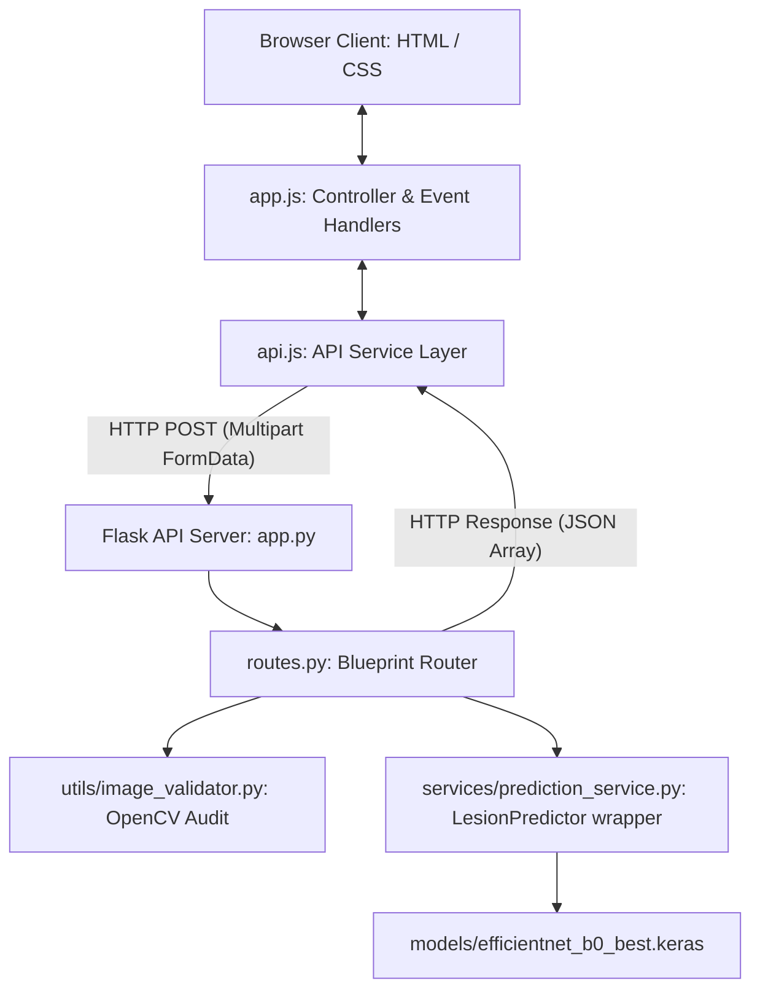

# Frontend-Backend Integration Report - Sprint 9

This report documents the architectural design, communication protocols, request/response sequences, and automated verification outcomes of connecting the Skin Cancer Detection User Interface to the Flask prediction API.

---

## 1. System Architecture

The following diagram illustrates the integration structure between the browser-based UI and the Flask deep learning model backend:



---

## 2. Communication Workflows

### A. Request Flow
1. **User Interaction**: The user drops an image file onto the `#drop-zone` or selects a file via the browser dialog using `#file-input`.
2. **Client Validation**: 
   * `app.js` catches the file selection and inspects its format (must be `.jpg`, `.jpeg`, or `.png`).
   * `app.js` checks the file size (must be `< 5MB`).
   * If client validation fails, a premium styled `.error-alert-card` is rendered directly in the drop zone.
3. **Image Preview**: If validation succeeds, a thumbnail preview is generated using `FileReader.readAsDataURL` and displayed in `#file-preview`.
4. **State Transition**: Default upload texts are hidden, and `#api-loading-spinner` is rendered with an active loading animation.
5. **API Client Dispatch**: `app.js` invokes `apiService.predictLesion(file)` from the API service layer (`api.js`), which serializes the file into a `FormData` multipart payload and executes an asynchronous `fetch` request to the `/api/predict` endpoint.

### B. Response Flow
1. **API Server Processing**:
   * The Flask server validates request headers and saves the image to a temporary directory.
   * `image_validator.py` checks file size constraints and executes an OpenCV decode read check to prevent corrupted byte stream submissions.
   * The `LesionPredictor` processes the image (resizing to 224x224, BGR to RGB translation, and scaling pixel values to `[0.0, 1.0]`).
   * The model generates class probability arrays.
2. **JSON Payloads**: The server cleans up the temporary upload and returns a `200 OK` JSON array containing classification mappings:
   ```json
   {
       "predicted_class": "mel",
       "confidence": 0.7814,
       "top_predictions": [
           {"class": "mel", "score": 0.7814},
           {"class": "vasc", "score": 0.0493},
           {"class": "df", "score": 0.0431}
       ]
   }
   ```
3. **Client Handshake**:
   * `api.js` resolves the HTTP response promise.
   * `app.js` hides the loading spinner.
   * A slide-in success toast (`.success-notification`) alerts the user: *Lesion analyzed successfully!*
   * The UI maps shorthand class codes (e.g. `mel`) to human-readable descriptors (e.g. `Melanoma (Malignant Lesion)`).
   * A colored `.risk-badge` is injected representing calculated risk profiles (Crimson/High for `mel`/`akiec`, Amber/Medium for `bcc`/`vasc`/`df`, Blue-Green/Low for `nv`/`bkl`).
   * The top 3 predictions are rendered in a horizontal progress bar layout. An animation translates their filled width from 0% to the corresponding confidence percentage.

---

## 3. Verification & Test Outcomes

To assert layout compliance and communication integrity, we executed the automated `verify_integration.py` test suite. The run verified both file inclusions and live endpoint responses:

```text
======================================================================
         SKIN CANCER DETECTION - INTEGRATION VERIFICATION SUITE       
======================================================================

--- Verifying Frontend File Structure & Inclusions ---
[SUCCESS] config.js setup frontend/config.js is valid and defines API_BASE_URL
[SUCCESS] api.js setup frontend/js/api.js is valid and exposes API service wrappers
[SUCCESS] index.html structure Inclusions and DOM container configurations are valid
[SUCCESS] style.css updates All integration style classes are present

--- Running End-to-End API Integration Communication Tests ---
Selected valid integration test image: ISIC_0024324.jpg
Launching Flask application server in background...
[SUCCESS] server launch Local Flask server is online and responding to health checks
[SUCCESS] GET /api/health response validation Response: {'model_loaded': True, 'status': 'healthy'}
[SUCCESS] POST /api/predict success response Response: {'confidence': 0.7814, 'predicted_class': 'mel', 'top_predictions': [{'class': 'mel', 'score': 0.7814}, {'class': 'vasc', 'score': 0.0493}, {'class': 'df', 'score': 0.0431}]}
[SUCCESS] POST /api/predict error validation Correctly blocked with status 400. Message: {'error': "Unsupported file format '.txt'. Only .jpg, .jpeg, and .png are allowed."}
Stopping background Flask server...

INTEGRATION VERIFICATION COMPLETE: ALL ASSERTS PASSED SUCCESSFULLY!
```

---

## 4. Run Guide for Local Environment

To launch the integrated system locally:

1. **Start the API Backend**:
   Run the Flask server:
   ```powershell
   python backend/app.py
   ```
2. **Access the Frontend**:
   * Open `frontend/index.html` in your web browser.
   * Drag-and-drop or select any skin lesion image (e.g. from `processed/` data folders) to see the live classification assessments.
